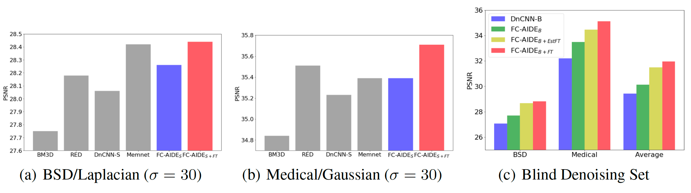

# [Fully Convolutional Adaptive Image Denoiser(FC-AIDE)](http://ieeexplore.ieee.org/document/7839189/)

# Contents

- code for testing
   * 'sigma_estimation.py'  
   : estimate a noise sigma of the noisy image
   * 'test_fc_aide_sup.py'  
   : denoise a noisy image using the supervised model trained on the specific noise level
   * 'test_fc_aide_ft.py'  
   : denoise a noisy image using the supervised model + fine-tuning
   * 'test_fc_aide_blind_sup.py'  
   : denoise a noisy image using the supervised model trained on various noise level
   * 'test_fc_aide_blind_ft.py'  
   : denoise a noisy image using the supervised model + fine-tuning
   * 'test_fc_aide_blind_estimated_sigma_ft.py'  
   : estimate a sigma of the noise level and then denoise using the supervised model + fine-tuning

- weights
   * 'sigmaX.hdf5'  : a weight trained on a specific noise level([15, 25, 30, 50, 75])
   * 'blind.hdf5'  : the weight trained on various noise levels([0,50])

- test images
   * 'Set13'
   * 'BSD68'
   * 'Medical60'
   

# Results


## Set13

**The average PSNR(dB) on Set13.**

| $\sigma$ 	|  BM3D 	|  RED  	| MemNet 	| DnCNN-S 	| DnCNN-B 	| FC-AIDE<sub>_S</sub> 	| FC-AIDE<sub>_S+FT</sub> 	| FC-AIDE<sub>_B</sub> 	| FC-AIDE<sub>_B+FT</sub> 	|
|:--------:	|:-----:	|:-----:	|:------:	|:-------:	|:-------:	|:--------------------:	|:-----------------------:	|:--------------------:	|:-----------------------:	|
|    15    	| 31.98 	|   -   	|    -   	|  32.21  	|  31.58  	|         32.08        	|          **32.59**          	|         31.72        	|          32.52          	|
|    25    	| 29.44 	|   -   	|    -   	|  29.63  	|  29.22  	|         29.57        	|          **30.14**          	|         29.34        	|          30.03          	|
|    30    	| 28.56 	| 28.91 	|  28.83 	|  28.64  	|  28.41  	|         28.73        	|          **29.28**          	|         28.50        	|          29.19          	|
|    50    	| 26.05 	| 26.28 	|  26.39 	|  26.09  	|  26.07  	|         26.24        	|          **26.87**          	|         26.05        	|          26.77          	|
|    75    	| 24.16 	|   -   	|    -   	|  24.03  	|  18.33  	|         24.24        	|          **24.97**          	|         21.07        	|          24.89          	|

## BSD68

**The average PSNR(dB) on BSD68.**

| $\sigma$ 	|  BM3D 	|  RED  	| MemNet 	| DnCNN-S 	| DnCNN-B 	| FC-AIDE<sub>_S</sub> 	| FC-AIDE<sub>_S+FT</sub> 	| FC-AIDE<sub>_B</sub> 	| FC-AIDE<sub>_B+FT</sub> 	|
|:--------:	|:-----:	|:-----:	|:------:	|:-------:	|:-------:	|:--------------------:	|:-----------------------:	|:--------------------:	|:-----------------------:	|
|    15    	| 31.07 	|   -   	|    -   	|  31.72  	|  31.60  	|         31.63        	|          **31.75**          	|         31.47        	|          31.72          	|
|    25    	| 28.56 	|   -   	|    -   	|  29.22  	|  29.15  	|         29.18        	|          **29.31**          	|         29.04        	|          29.26          	|
|    30    	| 27.74 	| 28.45 	|  28.42 	|  28.35  	|  28.34  	|         28.35        	|          **28.49**          	|         28.24        	|          28.44          	|
|    50    	| 25.60 	| 26.29 	|  26.34 	|  26.21  	|  26.20  	|         26.24        	|          **26.38**          	|         26.12        	|          26.33          	|
|    75    	| 24.19 	|   -   	|    -   	|  24.62  	|  18.68  	|         24.74        	|          **24.87**          	|         21.42        	|          24.76          	|

## Mismatch / blind case




# Requirements and Dependencies
- Python 2.7 / Python 3.6(Not confirmed)
- CUDA v8.0 / CuDNN v5.1
- Tensorflow v1.2.1
- Keras v2.0.8


# Citation

<!--
```
@article{zhang2017beyond,
  title={Beyond a {Gaussian} denoiser: Residual learning of deep {CNN} for image denoising},
  author={Zhang, Kai and Zuo, Wangmeng and Chen, Yunjin and Meng, Deyu and Zhang, Lei},
  journal={IEEE Transactions on Image Processing},
  year={2017},
  volume={26}, 
  number={7}, 
  pages={3142-3155}, 
}
```
--!>
